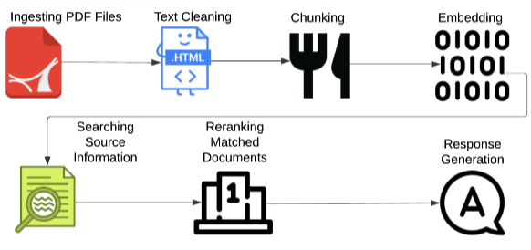
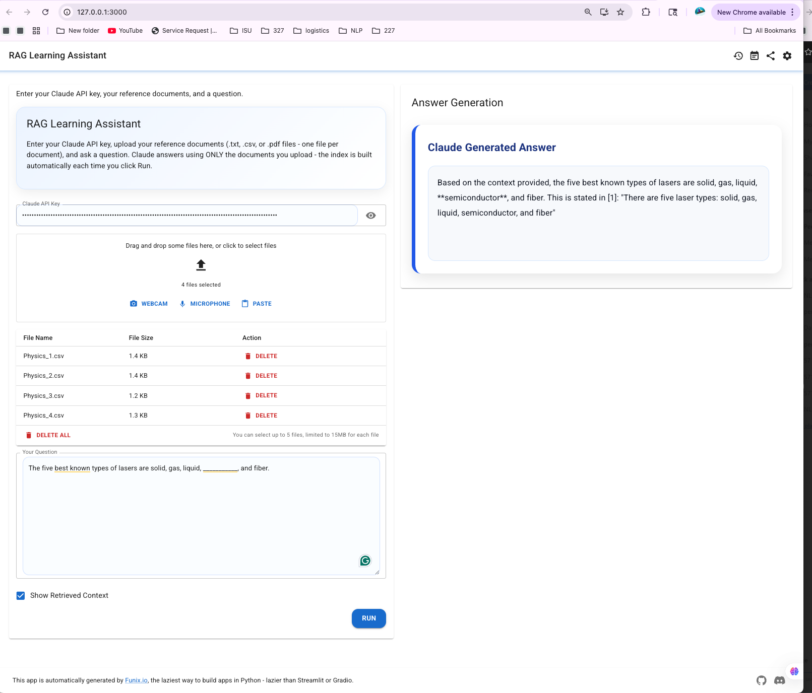

# RAG Assistant

A simple, naive Retrieval-Augmented Generation (RAG) pipeline built for teaching purposes

## Pipeline

```
data/documents/*.csv                       data/QA.txt
(16 document)                    (sample questions for eval)
      |                                    
      v
[1] Ingest & load each file as one document  
      v
[2] Chunking (RecursiveCharacterTextSplitter, chunk_size=400, overlap=50)
      v
[3] Embedding and Vector Index (sentence-transformers/all-MiniLM-L6-v2,FAISS)   
      v
[4] Retrieve top-k chunks for a question (RETRIEVAL_K = 4)
      v
[5] claude-haiku-4-5-20251001 Generate the answer    
```

Only step 5 costs money (a Claude API call per question). Step 3's embeddings
run locally on CPU with a small sentence-transformers model `all-MiniLM-L6-v2`.

## Architecture


## Setup

```bash
python3 -m venv .venv
source .venv/bin/activate        # Windows: .venv\Scripts\activate
pip install -r requirements.txt

cp .env.example .env
# then edit .env and set:
# ANTHROPIC_API_KEY=your_claude_api_key_here
```

## Usage

**1. Build the vector index** (run once, or whenever `data/documents.csv` changes):

```bash
python build_index.py
```

**2. Ask a question:**

```bash
python ask.py --question "What is a subset of the population called?"
```

**3. Run a batch of sample questions from `data/QA.txt`** and save results to
`output/qa_results.json`:

```bash
python run_eval.py
```

## The data

| Path | Description |
|---|---|
| `data/documents/` | 16 per-document CSV files — the knowledge base that gets embedded and retrieved from |
| `data/documents.csv` | The original raw source (255 rows, one sentence per row) the 16 files above were split from. Kept for reference; no code reads it directly anymore |
| `data/QA.txt` | 100 sample question/answer pairs used only for a rough, eyeball-level sanity check (`run_eval.py`), not real grading |

## Example (real run, `ask.py`)

```
Question: A ___________ is a subset of the population.

Answer: A **sample** is a subset of the population.

This is stated directly in the context: "A sample is a subset of the population."

Sources: [
  {"subject": "Statistics", "document_id": "1"},
  {"subject": "Statistics", "document_id": "1"},
  {"subject": "Statistics", "document_id": "1"},
  {"subject": "Statistics", "document_id": "1"}
]

Token usage: input_tokens=350, output_tokens=33, total_tokens=383
```

This result come from `run_eval.py` run against
`data/QA.txt` (model: `claude-haiku-4-5-20251001`) — all 4 retrieved chunks
## How to run apps.py

`apps.py` is an interactive web UI (built with [Funix](https://funix.io)) where you
upload your own documents and ask questions, instead of using the pre-built
`data/documents/` knowledge base.

```bash
source .venv/bin/activate        # Windows: .venv\Scripts\activate
funix apps.py
```

Then open the URL it prints (usually `http://127.0.0.1:3000`) in your browser.

**In the UI:**

1. **Claude API Key** — paste your Anthropic API key 
2. **Reference Documents** — upload one or more `.txt`, `.csv`, or `.pdf`
   files
3. **Your Question** — type your question
4. **Show Retrieved Context** — leave checked to see which chunks were
   retrieved before the final answer
5. Click **Run**

Anyone who clones this repo, installs `requirements.txt`, and runs the same
command will see the identical UI — nothing about it depends on your machine.

To stop the app: `Ctrl+C` in the terminal running it.

## Project structure

```
.
├── data/
│   ├── documents/            # 16 per-document CSV files - the actual knowledge base
│   ├── documents.csv         # original raw source (255 rows), kept for reference only
│   └── QA.txt                 # 100 sample question/answer pairs, for run_eval.py
│
├── src/
│   ├── config.py               #paths + model settings, shared by everything below
│   ├── ingest.py               # STEP 1: load data/documents/*.csv, load QA.txt
│   ├── vectorstore.py          # STEP 2+3: chunk, embed, build/load the FAISS index
│   └── rag_pipeline.py         # STEP 4+5: retrieve chunks, generate answer with Claude
│
├── build_index.py             # CLI: build the FAISS index from data/documents/ (run once)
├── ask.py                     # CLI: ask a single question
├── run_eval.py                 # CLI: batch-run questions from data/QA.txt
├── evaluate_metrics.py         # CLI: score a saved qa_results_*.json
├── data_analysis.py            # one-off: split data/documents.csv into data/documents/*.csv
│
├── apps.py                     # Funix web UI: upload documents, ask questions
│
├── output/                      # generated: faiss_index/, qa_results_*.json, evaluation_*.json (gitignored)
├── requirements.txt
├── .env.example
└── README.md
```

## Notes 

- For COMS 3710X/3720X Class
- Embedding + vector search: **free**, runs locally.
- Generation: one Claude API call per question. Default model is
  `claude-haiku-4-5-20251001` (cheapest current Claude model) — check
  Anthropic's pricing page for current per-token rates, and multiply by
  expected questions/student to estimate class-wide cost.
- No fine-tuning or GPU is required anywhere in this pipeline.
